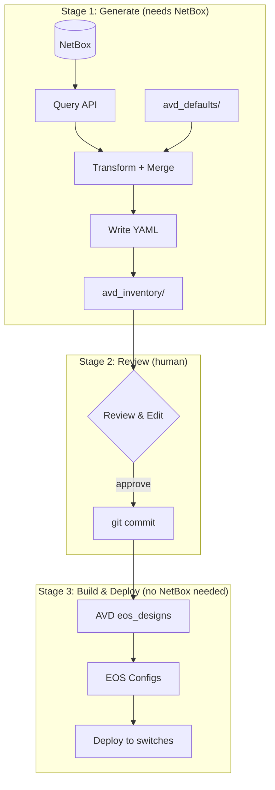
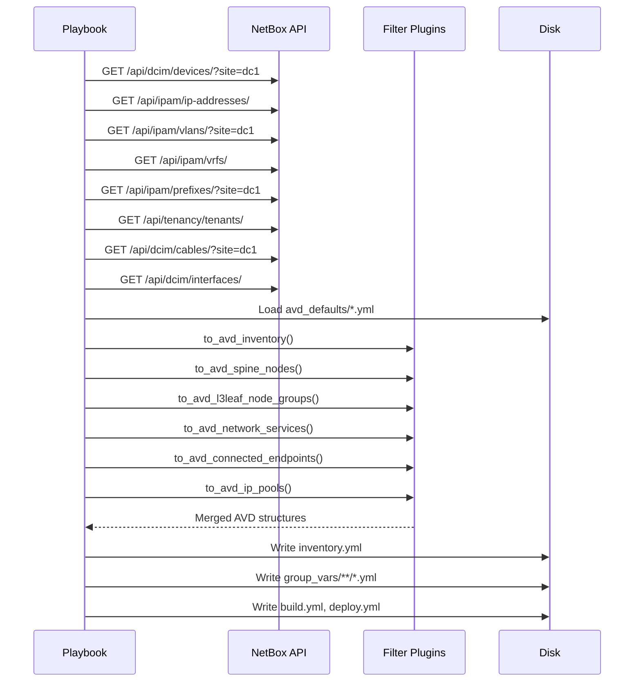

# Architecture

## Pipeline Overview

The collection implements a three-stage pipeline with a human review gate between generation and deployment:



!!! info "Decoupled by design"
    Stage 3 is completely independent of NetBox. The generated `avd_inventory/` directory contains everything AVD needs. If NetBox goes down, you can still build and deploy from the committed files.

## Data Flow Detail

### What the generate_avd role does



## Directory Structure

```
netbox_to_ansible_AVD/
├── ansible_collections/arista/netbox_avd/   # The collection (library)
│   ├── plugins/filter/netbox_to_avd.py      # Transform filters
│   ├── plugins/module_utils/netbox_client.py # NetBox REST client
│   ├── roles/generate_avd/                  # Main role
│   ├── examples/single-dc-l3ls/             # Example defaults
│   └── playbooks/generate_from_netbox.yml
│
├── sites/                                    # Reference outputs (committed)
│   └── dc1/
│       ├── avd_defaults/                    # Local overrides
│       ├── avd_inventory/                   # GENERATED + committed
│       │   ├── inventory.yml
│       │   ├── group_vars/                  # AVD input YAML
│       │   └── intended/configs/            # EOS configs (after AVD build)
│       └── generate.yml
│
├── tests/                                   # Unit + integration tests
├── docker/                                  # NetBox test stack
└── .github/workflows/ci.yml                # CI with golden-file verification
```

## Merge Strategy

The tool merges data from two sources:

| Layer | Source | Priority | Example |
|-------|--------|----------|---------|
| **NetBox data** | API queries | Higher (overwrites) | Device names, IPs, VLANs, BGP AS |
| **Local defaults** | `avd_defaults/*.yml` | Lower (base) | Platform, STP, passwords |

The merge uses `to_avd_merge_defaults` -- a recursive deep-merge where NetBox-derived values overwrite defaults at the leaf level, but both trees are preserved.

```yaml
# avd_defaults/spines.yml (base)     # From NetBox (override)       # Output
spine:                                spine:                         spine:
  defaults:                             defaults:                      defaults:
    platform: cEOSLab        +            bgp_as: 65100        =        platform: cEOSLab
                                          loopback_ipv4_pool:            bgp_as: 65100
                                            10.255.0.0/27                loopback_ipv4_pool: 10.255.0.0/27
                                        nodes:                         nodes:
                                          - name: dc1-spine1             - name: dc1-spine1
                                            id: 1                          id: 1
                                            mgmt_ip: 172.16.1.11/24        mgmt_ip: 172.16.1.11/24
```
