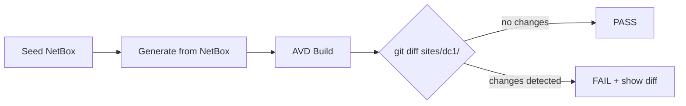

# CI/CD & Verification

## Golden-File Testing

The committed output in `sites/dc1/avd_inventory/` serves as a **golden file** -- a known-good reference that CI verifies on every change.

### How It Works



On every push and pull request, CI:

1. Starts a fresh NetBox v4.1 stack (Docker Compose)
2. Seeds it with the reference topology (`tests/fixtures/seed_netbox.py`)
3. Runs `generate.yml` to regenerate `sites/dc1/avd_inventory/`
4. Runs AVD `build.yml` to regenerate EOS configs
5. Diffs the output against the committed files
6. **Fails if anything changed** -- showing exactly what drifted

### What This Catches

| Change | CI catches it? | What happens |
|--------|---------------|--------------|
| Modified a filter plugin | Yes | Generated YAML changes → diff detected |
| Changed the seeder data | Yes | Different NetBox data → different output |
| Upgraded AVD version | Yes | AVD may generate different configs |
| Edited avd_defaults | Yes | Merge output changes |
| NetBox API format changed | Yes | Transforms produce different results |

### Updating the Reference

When you intentionally change the output (new feature, updated defaults), regenerate and commit:

```bash
make generate   # Regenerate sites/dc1/ from NetBox
git add sites/dc1/avd_inventory/
git commit -m "Update reference output for <reason>"
```

## CI Pipeline

The full pipeline has 4 jobs:

```yaml
lint           → flake8, yamllint, ansible-lint
unit-tests     → pytest (Python 3.10, 3.11, 3.12 matrix)
integration    → Docker NetBox + seed + pytest + generate + AVD build + verify
build          → ansible-galaxy collection build
```

### Running CI Locally

```bash
# Start NetBox and seed
make up
make seed

# Run all checks
make lint
make test-unit
make test-integration
make verify          # Generate + diff against committed
```

## Local Verification

The `make verify` target reproduces what CI does:

```bash
$ make verify
=== Regenerating sites/dc1 from NetBox ===
...
=== Checking for drift ===
PASS: All generated output matches committed reference.
```

If it fails:

```bash
$ make verify
=== Checking for drift ===
FAIL: Generated output differs from committed reference!
 sites/dc1/avd_inventory/group_vars/DC1_SPINES/spines.yml | 2 +-
 1 file changed, 1 insertion(+), 1 deletion(-)
```

Review the diff, confirm it's intentional, and commit the update.
