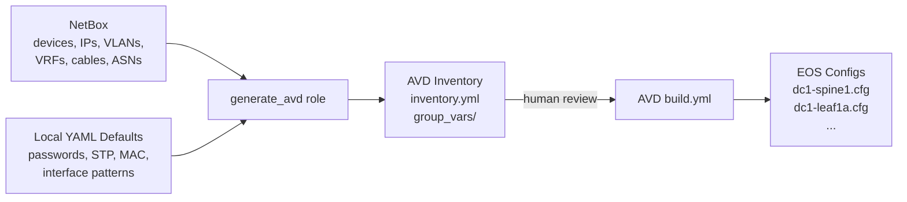

# arista.netbox_avd

**Generate Arista AVD inventory from NetBox as source of truth.**

This Ansible collection bridges [NetBox](https://netbox.dev/) and [Arista AVD](https://avd.arista.com/) by transforming NetBox topology data into ready-to-run AVD inventory files. A human can review and optionally edit the generated YAML before running AVD to produce EOS device configurations.

## How It Works



## What Comes From Where

| Source | Data |
|--------|------|
| **NetBox** | Devices, roles, management IPs, BGP AS numbers, MLAG groups, IP pools (loopback, VTEP, P2P, MLAG), tenants, VRFs with VNIs, VLANs with prefixes, server cables, interface modes |
| **Local YAML** | Platform type, spanning tree, virtual router MAC, BGP passwords, AAA users, DNS/NTP/CVP, interface naming patterns, Ansible connectivity |

## Key Features

- **NetBox as source of truth** -- topology, IP addressing, network services, and connectivity all come from NetBox
- **Decoupled pipeline** -- generated YAML files are standalone; AVD runs without NetBox
- **Human-in-the-loop** -- review and edit generated files before building configs
- **Golden-file CI** -- CI regenerates output and verifies it matches the committed reference
- **Sister project** -- follows the same patterns as [netbox_to_ansible_velocloud](https://github.com/claudebouchard-arista/netbox_to_ansible_velocloud) and [netbox_to_ansible_cvcue](https://github.com/claudebouchard-arista/netbox_to_ansible_cvcue)

## Quick Start

```bash
# Install the collection
ansible-galaxy collection install arista.netbox_avd

# Set up your site
mkdir -p sites/mysite/avd_defaults
cp examples/single-dc-l3ls/avd_defaults/* sites/mysite/avd_defaults/

# Generate from NetBox
NETBOX_URL=http://your-netbox:8000 NETBOX_TOKEN=your-token \
  ansible-playbook sites/mysite/generate.yml

# Build EOS configs with AVD
cd sites/mysite/avd_inventory
ansible-playbook build.yml -i inventory.yml
```

See [Getting Started](getting-started.md) for the full walkthrough.
